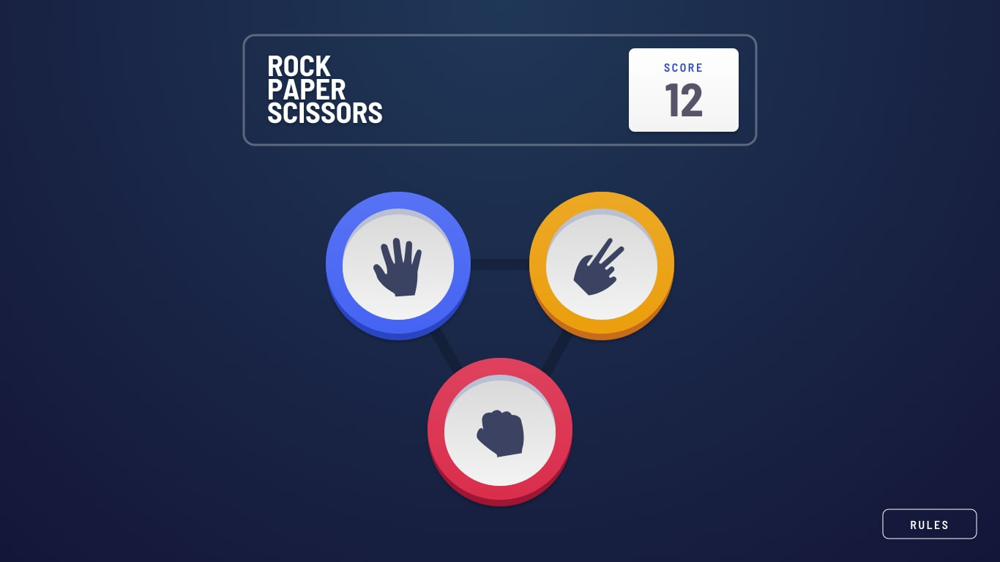

# Frontend Mentor - Rock, Paper, Scissors solution

This is a solution to the [Rock, Paper, Scissors challenge on Frontend Mentor](https://www.frontendmentor.io/challenges/rock-paper-scissors-game-pTgwgvgH). Frontend Mentor challenges help you improve your coding skills by building realistic projects. 

## Table of contents

- [Overview](#overview)
  - [The challenge](#the-challenge)
  - [Screenshots](#screenshots)
  - [Links](#links)
- [My process](#my-process)
  - [Built with](#built-with)
  - [Continued development](#continued-development)
  - [Getting Started](#getting-started)
  - [Process Description](#process-description)
    - [Environments](#environments)
    - [Deployment](#deployment)
    - [Commits and Branching](#commits-and-branching)
    - [File Structure](#file-structure)
    - [Backlog](#backlog)
- [Author](#author)
- [Licensing](#licensing)

## Overview

### The challenge

Users should be able to:

- View the optimal layout for the game depending on their device's screen size `Only basic responsivness, no mobile support`
- Play Rock, Paper, Scissors against the computer
- Maintain the state of the score after refreshing the browser _(optional)_ `Not Implemented`
- **Bonus**: Play Rock, Paper, Scissors, Lizard, Spock against the computer _(optional)_ `Not Implemented`

Development Decisions explained:

This project was created with small time boxes, beside my regular job and other higher priority projects, so time was a key here. Just like all other projects from Frontend Mentor it's training project, so no fireworks here, just simple logic and styling, as secondary goal was to practice skills that I already have, no experimenting (pipeline is exception here). Based on that I decided to ommit some features:

- Only desktop support, no mobile/tablets/laptops dedicated responsivness provided,
- No outline on winner's option on results state,
- I didn't buy access to Figma mockups on Frontend Mentor, so all styling that was not provided in styles guide was my guess from graphics editors' color selectors,
- This funny method of loading background triangle on main view is because GitHub Pages constraints (probably between Angular Routing and Sass paths on server) cousing to throw HTTP 404 on test env for background triangle image. This method works both on dev env and test env. Link to StackOverflow with solution in comment over that code.
- All images (beside background triangle) were loaded with Angular Material's MatIcon registry, not the best solution for all of them, but the quickest.

### Screenshots

Mockups:

Real App (GitHub Pages Test Environment):

### Links

Test Environment - [GitHub Pages](https://straykerpl.github.io/RockPaperScissors/)

## My process

### Built with

- Angular 14 on Node.js v18.12.0,
- HTML5,
- Sass (SCSS notation + BEM),
- TypeScript,
- Angular Material library,
- Husky Pre-Commit hooks + Prettier,
- Deploy Pipeline - Node.js Build with GitHub Artefacts on GitHub Actions pipeline + GitHub Pages hosting,

### Continued development

Things that can be implemented to this project, but I'm not currently intrested to do it:

- Backend/SignalR/Socket.io/URL Links for real multiplayer,
- Add main menu for control over app,
- Local/Global Scoreboard,
- Custom player's nicknames,
- Some personalisation settings,

### Getting Started

1. Clone repo on your device, enter repo's folder via CLI,
2. Enter `rock-paper-scissors-frontend` folder,
3. Run `npm install` command,
4. After successful install, run `npm run hooks-setup` to make sure, that Husky hooks are working,
5. Finally, run `npm run dev` to start dev build and local server for it,
6. You are ready to go! If not performed automatically, navigate to https://localhost:4200 and see the app's UI.

### Process Description

### Environments

In project, there are two programming environments - `development` and `production`. The first one has disabled some of compiler's features, like automatic optimisations and licenses extraction. The secend one has all compiler's features enabled. For test environment deployments `production` is used.

### Deployment

For deploying on your own hosting (VPS, local web server, Azure etc.) you can use `npm run prod-build` script command to run default build in production config. This will produce compiled files in repo's `dist` folder. It is also possible to create new pipeline based on test deploy one and run this command there to push compiled files somewhere else.

To deploy changes on test environment, PR must be created to merge custom branch into `develop`. After successful merge, GitHub will trigger deploy automatically. GitHub Pages should refresh instantly, but sometimes it can take 5-10 minutes to proceed request, depends probably on server's load.

Do NOT use `npm run prod-gh-pages-build` script command for custom deployment! This command provides some extra config for compiler and must be used ONLY for GitHub Pages deployment.

### Commits and Branching

- For commits in this repo [Conventional Commits](https://www.conventionalcommits.org/en/v1.0.0/) is used,
- For branches in this repo [Git Flow](https://www.atlassian.com/git/tutorials/comparing-workflows/gitflow-workflow) is used,

#### File Structure

Project in repo was created using `create-angular-app` template. In `docs` folder are files provided by Frontend Mentor to create the app's visuals. All code files are located in `src` folder, other files are documents or config files. Under `src` there are: `app`, `assets`, `environments`, `shared` folders and website's files, default to Angular. In `app` folder, there's files for main component and all other components to build the website, under `components` folder. `assets` is used to store non-code data for app, like pictures, icons etc. `environments` stores config fles for app to run in correct configuration. `shared` folder holds module, that is used across the howl app to deliver code, data etc. that are used globally.

#### Backlog

Product Backlog is stored as GitHub Issues, managed by me with GitHub Projects. In Kanban board on GitHub Projects, there are 5 columns: `Backlog`, `In Progress`, `Ready`, `In Test`, `Done`.

The flow of tasks is as follows:
- `Backlog` stores all tasks to be done in project,
- Task is moved to `In Progress` when work over it just started,
- Task is moved to `Ready` after successful merge of PR to `develop` branch,
- Task is moved to `In Test` when testing process is starting on test environment,
- Task is moved to `Done` when testing did not find any bugs,

## Author

- Website - [Daniel "Strayker" Nowak](https://straykerpl.github.io)
- Frontend Mentor - [FrontendMentor/StraykerPL](https://www.frontendmentor.io/profile/StraykerPL)

## Licensing

This project is licensed under MIT license, but I don't own files from Frontend Mentor. Please refer to [Frontend Mentor](https://www.frontendmentor.io/license) for licensing terms for this files.